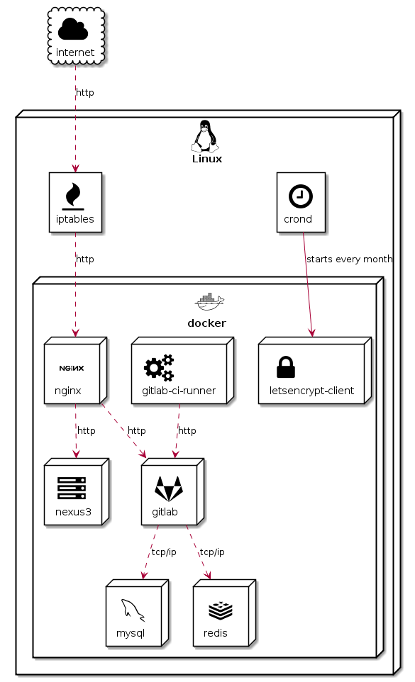

PlantUML Icon-Font Sprites
------------------------------------------
Sample for https://github.com/tupadr3/plantuml-icon-font-sprites

## Post
[PlantUML Icon-Font Sprites](https://tupadr3.de/plantuml-icon-font-sprites)

## Example
```puml
@startuml

!define ICONURL https://raw.githubusercontent.com/tupadr3/plantuml-icon-font-sprites/v1.0.0

!includeurl ICONURL/common.puml
!includeurl ICONURL/font-awesome/server.puml
!includeurl ICONURL/font-awesome/gitlab.puml
!includeurl ICONURL/font-awesome/gears.puml
!includeurl ICONURL/font-awesome/fire.puml
!includeurl ICONURL/font-awesome/clock_o.puml
!includeurl ICONURL/font-awesome/lock.puml
!includeurl ICONURL/font-awesome/cloud.puml

!includeurl ICONURL/devicons/nginx.puml
!includeurl ICONURL/devicons/mysql.puml
!includeurl ICONURL/devicons/redis.puml
!includeurl ICONURL/devicons/docker.puml
!includeurl ICONURL/devicons/linux.puml

FA_CLOUD(internet,internet,cloud) #White {  
}

DEV_LINUX(debian,Linux,node){  
  FA_CLOCK_O(crond,crond) #White
  FA_FIRE(iptables,iptables) #White

  DEV_DOCKER(docker,docker,node)  {
    DEV_NGINX(nginx,nginx,node) #White
    DEV_MYSQL(mysql,mysql,node) #White
    DEV_REDIS(redis,redis,node) #White
    FA_SERVER(nexus,nexus3,node) #White
    FA_GITLAB(gitlab,gitlab,node) #White
    FA_GEARS(gitlabci,gitlab-ci-runner,node) #White

    FA_LOCK(letsencrypt,letsencrypt-client,node) #White
  }
}

internet ..> iptables : http

iptables ..> nginx : http  
nginx ..> nexus : http  
nginx ..> gitlab : http  
gitlabci ..> gitlab : http  
gitlab ..> mysql : tcp/ip  
gitlab ..> redis : tcp/ip

crond --> letsencrypt : starts every month

@enduml
```



